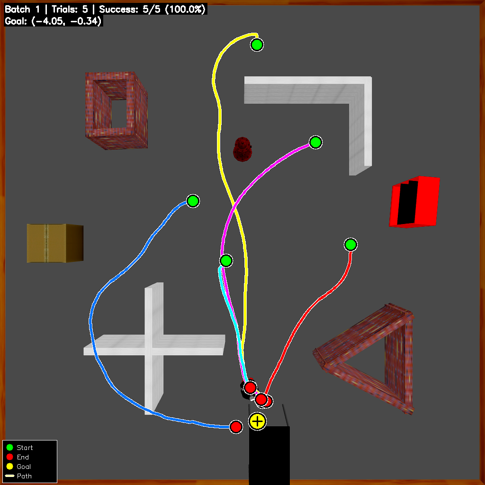
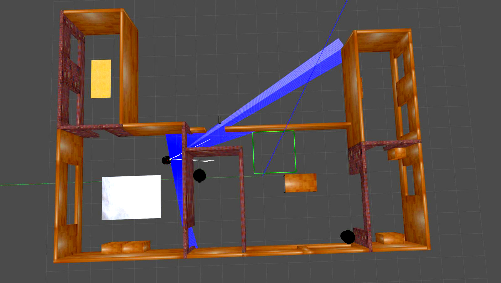
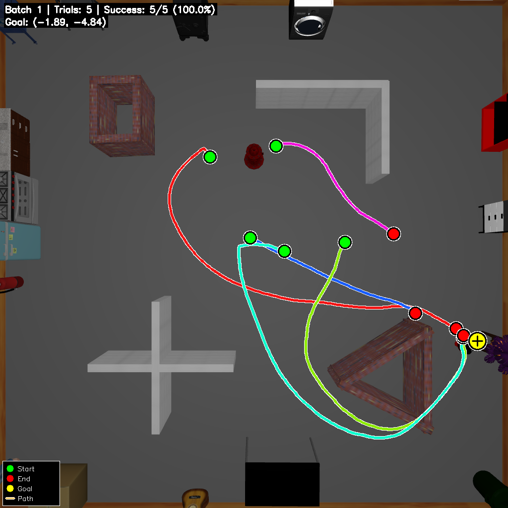
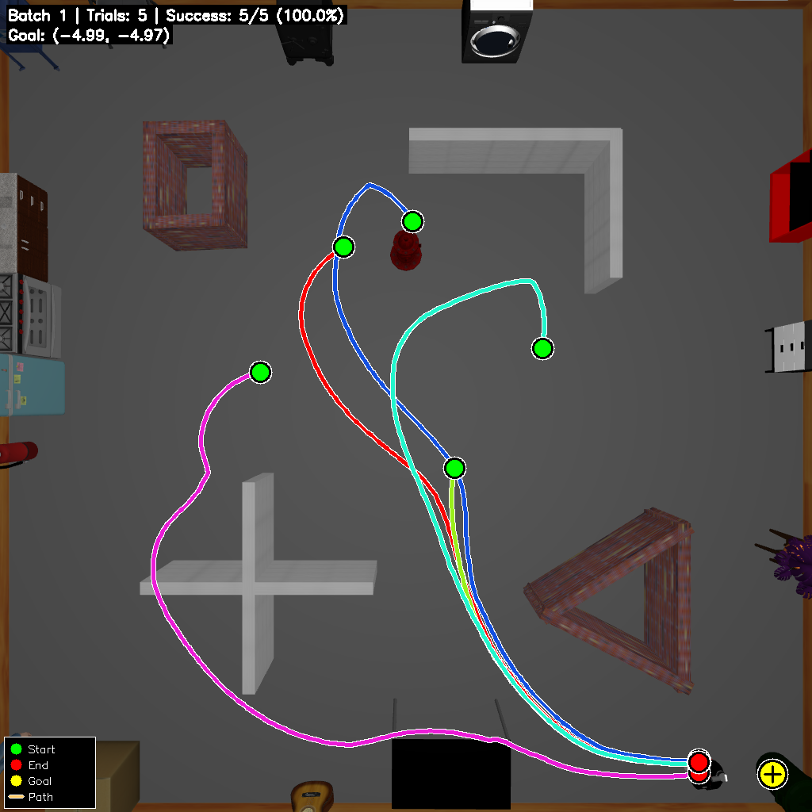
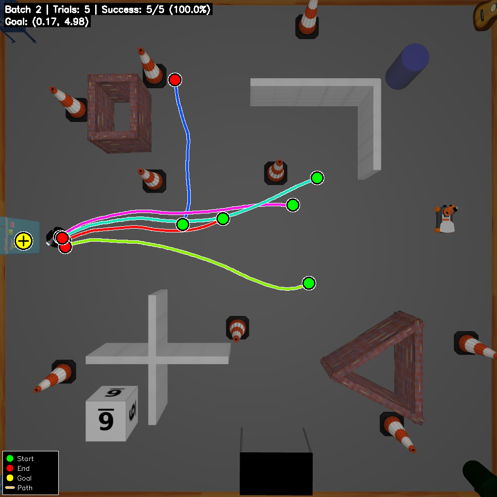
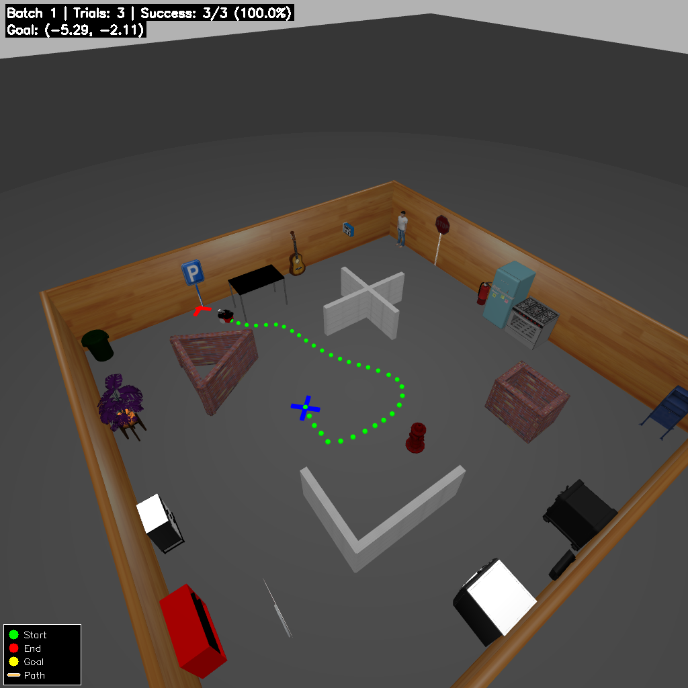

# VLM + DRL Autonomous Robot — Object Navigation

Autonomous robot navigation using Deep Reinforcement Learning (TD3) combined with Vision-Language Models (VLM) for semantic object detection and goal-directed navigation in Gazebo simulation. The robot explores an unknown environment, detects target objects using VLM inference, and navigates to them using a trained TD3 policy.

---

## Environments & Results

### Single-Room Environment (Basic)
The robot navigates a single-room world with scattered objects. Colored trajectories show multiple trials — the robot successfully reaches the goal (100% success rate).



---

### Multi-Room Environment
A six-room house environment viewed from above in Gazebo. The robot's LiDAR field of view (blue cone) spans multiple rooms, enabling frontier-based exploration across doorways.



---

### Many-Objects Environment — Plant Target
Dense object environment (`TD3_many.world`) where the robot navigates to a **plant** target. Multiple overlapping trajectories demonstrate consistent success across 5 trials.



---

### Many-Objects Environment — Trash Can Target
Same dense environment, but targeting a **trash can**. The robot adapts its path across trials while reliably reaching the goal.



---

### Obstacle Stress Test — Fridge Target
`TD3_obs.world` adds traffic cones and boxes as obstacles. The robot navigates around them to reach a **fridge** target, demonstrating robust obstacle avoidance.



---

### Parking Sign Navigation (3D View)
First-person Gazebo view of the robot navigating toward a **parking sign** in a cluttered indoor scene. The green dotted path shows the planned trajectory to the detected target.



---

## Prerequisites

- ROS (sourced workspace)
- Gazebo with `multi_robot_scenario` package built
- Python 3.10+
- pip dependencies (see [Installation](#installation))

---

## Installation

### 1. Install Moondream

Moondream is **not** included in `requirements.txt`. Follow the official setup guide for your preferred backend:

> **https://docs.moondream.ai/transformers/**

### 2. Install remaining dependencies

```bash
cd TD3/

# Create a virtual environment
python3 -m venv vlmenv

# Activate it
source vlmenv/bin/activate

# Install all dependencies
pip install -r requirements.txt
```

> **Note — PyTorch + CUDA:** For GPU acceleration (strongly recommended for Moondream), install the CUDA build before running the command above:
>
> ```bash
> pip install torch==2.9.1 torchvision==0.24.1 --index-url https://download.pytorch.org/whl/cu124
> ```
>
> Then re-run `pip install -r requirements.txt` (torch is already present, the rest will install).

### 3. Build the ROS workspace

The `build/`, `devel/`, `build_isolated/`, and `devel_isolated/` directories are **not included** in the repository and must be generated locally.

> **Important:** Deactivate any Python virtual environment before building, so CMake uses the system Python required by ROS.

```bash
# Deactivate venv if active
deactivate

cd catkin_ws/

# Standard build (generates build/ and devel/)
catkin_make

# --- OR isolated build (generates build_isolated/ and devel_isolated/) ---
catkin_make_isolated
```

After building, source the workspace in every terminal that uses ROS:

```bash
source catkin_ws/devel/setup.bash
# or:
source catkin_ws/devel_isolated/setup.bash
```

---

## Quick Start

### GPT-4o VLM Backend (optional)

If you want to use `--vlm gpt4o`, you need an OpenAI API key.

1. Get your API key at: **https://platform.openai.com/api-keys**
2. Open `TD3/GPT_VLM.py` and replace the placeholder on line 24:

```python
api_key = "YOUR OWN API KEY"  # <-- replace this with your actual key
```

---

### Terminal 1 — Start the VLM Server (Moondream)

```bash
cd TD3/
source vlmenv/bin/activate
uvicorn vlm_server:app --host 127.0.0.1 --port 8000 --workers 1
```

API docs available at: http://127.0.0.1:8000/docs

---

### Terminal 2 — Run the Explorer Robot

Set up the ROS environment (replace `<your_path>` with the absolute path where you cloned this repo):

```bash
export PROJECT_ROOT=<your_path>/VLM_DRL-based-autonomous-robot-ObjectNav

export ROS_HOSTNAME=localhost
export ROS_MASTER_URI=http://localhost:11311
export ROS_PORT_SIM=11311
export GAZEBO_RESOURCE_PATH=$PROJECT_ROOT/catkin_ws/src/multi_robot_scenario/launch
source ~/.bashrc
source $PROJECT_ROOT/catkin_ws/devel_isolated/setup.bash
export GAZEBO_RESOURCE_PATH=$PROJECT_ROOT/TD3:$GAZEBO_RESOURCE_PATH
```

> **Example:** if you cloned into `/home/john/projects`, then set:
> `export PROJECT_ROOT=/home/john/projects/DRL-robot-navigation`

Then activate the environment and launch the explorer:

```bash
cd TD3/
source vlmenv/bin/activate
python3 explorer_node.py
```

#### Explorer Node Options

| Argument | Values | Description |
|---|---|---|
| `--vlm` / `-a` | `moondream` (default), `gpt4o` | VLM backend for object detection |
| `--world` / `-w` | `TD3.world` (default), `turtlebot3_house.world` | Gazebo simulation world |

**Examples:**

```bash
# Default (Moondream VLM, one-room world)
python3 explorer_node.py

# Use GPT-4o mini VLM
python3 explorer_node.py --vlm gpt4o

# Six-room house world
python3 explorer_node.py --world turtlebot3_house.world

# Combine options
python3 explorer_node.py --vlm moondream --world turtlebot3_house.world
```

**Available worlds:**

| World file | Description |
|---|---|
| `TD3.world` | Single room |
| `turtlebot3_house.world` | Six-room house |
| `TD3_many.world` | Single room with many objects |
| `TD3_signs2.world` | Environment with sign objects |
| `TD3_obs.world` | Obstacle stress test environment |

---

### Terminal 3 — Post-Exploration Pipeline

Run **after** exploration is complete:

```bash
source vlmenv/bin/activate
python3 coordinate_retriever.py
```

---

## Project Structure

```
DRL-robot-navigation/
├── TD3/
│   ├── requirements.txt          # All pip dependencies (install once)
│   ├── explorer_node.py          # Main exploration node
│   ├── vlm_server.py             # VLM inference server (FastAPI + Moondream)
│   ├── pixel_to_cords.py         # VLM response processor
│   ├── coordinate_retriever.py   # Post-exploration pipeline
│   ├── td3_agent.py              # TD3 RL agent
│   ├── models.py                 # Neural network models
│   ├── realsense_env.py          # RealSense camera environment
│   ├── velodyne_env.py           # Velodyne LiDAR environment
│   └── assets/
│       └── multi_robot_scenario.launch
└── catkin_ws/
    └── src/
        └── multi_robot_scenario/ # ROS package (robot URDF, launch, config)
```

---

## Testing — Retrieve Detected Object Coordinates

After a full exploration run, use `coordinate_retriever.py` to query the detected objects and verify the robot found its targets:

```bash
cd TD3/
source vlmenv/bin/activate
python3 coordinate_retriever.py
```

This reads `detected_objects.jsonl` (saved during exploration) and prints the 3D world coordinates of all detected objects. Use it to confirm the pipeline is working end-to-end.
